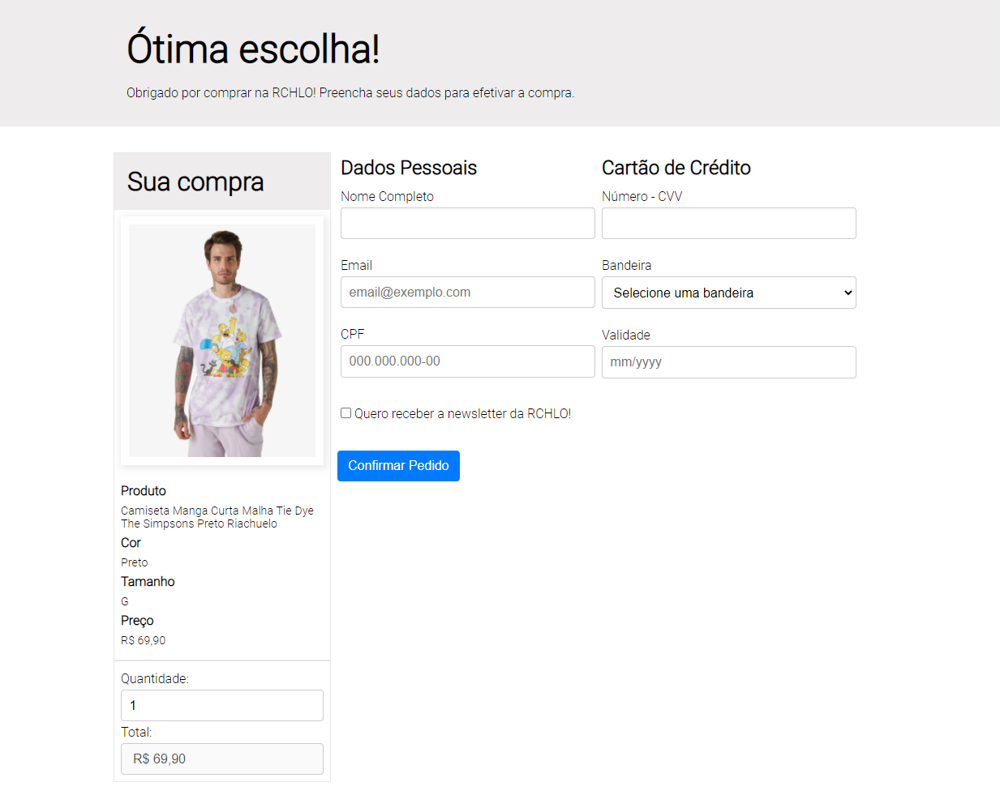

<h1 align="center">Projeto Uptech</h1>

  <a href="#dart-about">About</a> &#xa0; | &#xa0;
  <a href="#sparkles-features">Features</a> &#xa0; | &#xa0;
  <a href="#rocket-technologies">Technologies</a> &#xa0; | &#xa0;
  <a href="#white_check_mark-requirements">Requirements</a> &#xa0; | &#xa0;
  <a href="#checkered_flag-starting">Starting</a> &#xa0; | &#xa0;
  <a href="#memo-license">License</a> &#xa0; | &#xa0;
  <a href="https://github.com/lucasilvadrm" target="_blank">Author</a>

 

## :dart: About

Project developed as a form of evaluation.

## Screenshots

## :rocket: Technologies

The following tools were used in this project:

- [HTML](https://devdocs.io/html/)
- [CSS](https://developer.mozilla.org/pt-BR/docs/Web/CSS)
- [Javascript](https://developer.mozilla.org/pt-BR/docs/Web/JavaScript)

## :white_check_mark: Requirements

Before starting :checkered_flag:, you need to have [Git](https://git-scm.com)

## :checkered_flag: Starting

bash
# Clone this project
$ git clone https://github.com/lucasilvadrm/projeto-uptech

# Access
$ cd projeto-uptech

# Open in your favorite browser

Made with :heart: by <a href="https://github.com/lucasilvadrm" target="_blank">Lucas Silva</a>

&#xa0;

<a href="#top">Back to top</a>